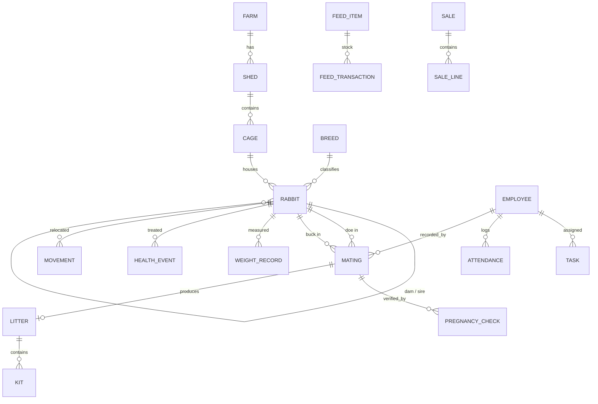
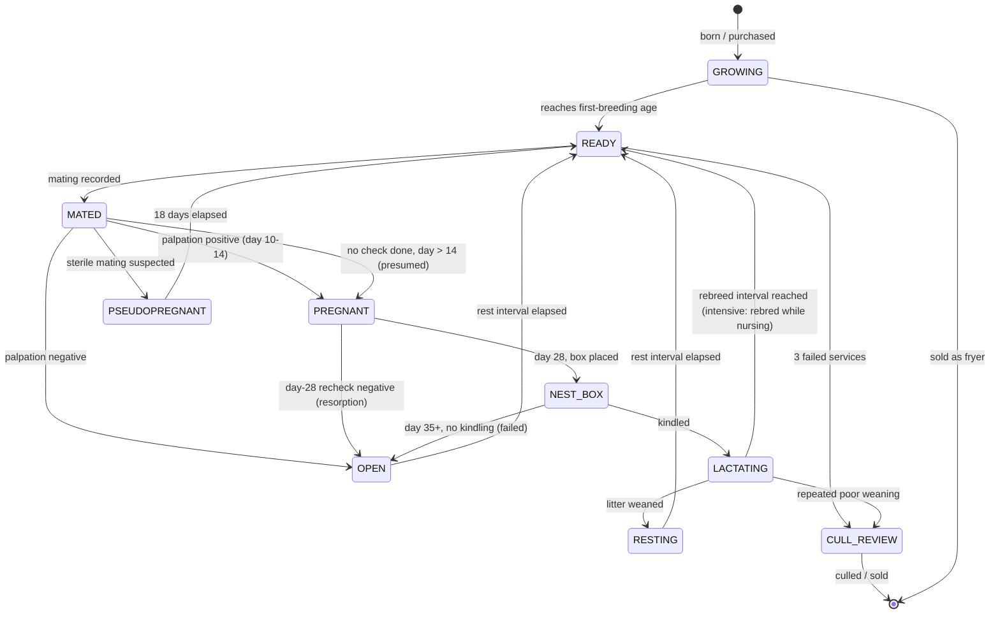

# 02 — Data Model

## Guiding principle: event sourcing for reproduction

Reproductive status is **computed**, never stored. The write path records what a
person observed and when. The read path derives status from those observations.

```
WRITE (facts people observe)        READ (states the app computes)
──────────────────────────────      ──────────────────────────────
mating recorded          ─┐
palpation result         ─┼──────►  doe status: MATED / PREGNANT / OPEN
kindling recorded        ─┤         due window, days pregnant
weaning recorded         ─┘         ready-to-mate eligibility
```

Why this matters: with a stored `is_pregnant` flag, a doe who aborts and is
never updated stays "pregnant" forever, the pregnant count is wrong, and staff
stop trusting the dashboard. With derived state, a missing kindling record
surfaces as an **overdue alert** — the system tells you it needs attention
instead of silently lying.

---

## Entity relationship overview



---

## Core entities

### `rabbit`
The central record. One row per animal, breeding stock and growers alike.

| Field | Purpose |
|---|---|
| `tag` | Ear tattoo / tag number. **Unique per farm.** The thing staff actually say out loud |
| `sex` | `doe` / `buck` |
| `role` | `breeder` / `grower` / `replacement` / `pet` |
| `breed_id` | Drives default first-breeding age (breed size) |
| `date_of_birth` | Drives age gates and culling suggestions |
| `dam_id`, `sire_id` | Self-references. **Required for inbreeding checks** |
| `origin` | `born_here` / `purchased` — purchased animals start in quarantine |
| `status` | `active` / `quarantine` / `sold` / `culled` / `dead` |
| `cage_id` | Current location; history in `movement` |
| `litter_id` | The litter this animal was born in, if born here |

> **Note:** `status` here is *lifecycle* (is this animal on the farm?), which is
> a genuine stored fact. It is **not** reproductive status. Keep the two
> strictly separate — conflating them is how these models rot.

### `mating`
One row per service event. The anchor of the whole reproductive cycle.

| Field | Purpose |
|---|---|
| `doe_id`, `buck_id` | Who |
| `mated_at` | Timestamp. **Day 0** for all gestation maths |
| `service_count` | 1 or 2 (double service is common practice) |
| `service_observed` | Boolean — was a successful service actually witnessed? |
| `receptivity` | `receptive` / `not_receptive` / `unknown` (+ optional vulva colour) |
| `method` | `natural` / `ai` |
| `outcome` | `pending` / `pregnant` / `negative` / `pseudopregnant` / `aborted` / `kindled` — **derived and cached**, see below |
| `recorded_by` | Employee — enables accountability and per-staff conception rates |

`outcome` is the one exception to "never store status": it is a **cached
projection** recomputed whenever a related check or litter is written. It is
never hand-edited. It exists purely so the "how many are pregnant" query stays
fast without recursion through every event.

### `pregnancy_check`
One row per palpation or ultrasound.

| Field | Purpose |
|---|---|
| `mating_id` | Which cycle |
| `checked_on` | Date; day-of-gestation is computed from `mating.mated_at` |
| `method` | `palpation` / `ultrasound` / `observation` |
| `result` | `positive` / `negative` / `uncertain` |
| `checked_by` | Palpation skill varies enormously between people — track it |

Multiple checks per mating are expected and normal: day 12 and again at day 28.
The **latest** check wins. A day-12 positive followed by a day-28 negative means
resorption, and the doe returns to the mating queue.

### `litter`
The kindling event and its outcome.

| Field | Purpose |
|---|---|
| `mating_id`, `doe_id` | Parentage |
| `nest_box_placed_on` | Compliance check against day 28 |
| `kindled_on` | Actual date. Gestation length = `kindled_on − mated_at` |
| `born_alive`, `born_dead` | Litter performance |
| `fostered_in`, `fostered_out` | Kits moved between does — common practice, wrecks counts if unmodelled |
| `weaned_on`, `weaned_count`, `avg_weaning_weight_g` | The KPI inputs |

### `kit`
Individual kits are **only** tracked when they matter — animals kept as
replacements or sold as breeders. Tracking 60 anonymous fryers individually is
data entry nobody will do. Litter-level counts carry the rest.

When a kit is retained, it is **promoted** into a full `rabbit` row with
`litter_id` pointing back.

### `medication_protocol`
A course of doses defined once and applied automatically to every doe reaching
the anchor event.

| Field | Purpose |
|---|---|
| `name` | e.g. "Ostovet (pre-delivery)". Farm-defined; no medicine is hard-coded |
| `anchor` | `mating` / `expected_kindling` / `kindling` / `weaning` |
| `start_offset_days` | Negative counts backwards — `-5` from expected kindling |
| `doses`, `interval_days` | 5 doses, 1 day apart |
| `withdrawal_days` | If it is an antibiotic, blocks meat sale for this long |

Doses are **not** stored as rows. They are expanded on read from
(anchor date + offset + n × interval), so changing a protocol immediately
corrects every future dose without a migration. A dose leaves the due list when
a matching `health_event` exists — the same derive-don't-store rule as
reproductive status.

### `employee`
See [04-employee-module.md](04-employee-module.md).

### `task`
Auto-generated from the breeding calendar plus manually added work. See
[03-breeding-engine.md](03-breeding-engine.md).

---

## The doe reproductive state machine

This is the heart of the application.



### State definitions

| State | Definition | Shown on dashboard as |
|---|---|---|
| `GROWING` | Below first-breeding age | Growers |
| `READY` | Eligible to mate today | **Ready to mate** ← key screen |
| `MATED` | Serviced, awaiting pregnancy check (days 0–13) | Awaiting check |
| `PREGNANT` | Positive check, **or** presumed after day 14 with no check | **Pregnant** ← key count |
| `NEST_BOX` | Day 28+, box in, awaiting kindling | Due this week |
| `LACTATING` | Kindled, litter not yet weaned | Nursing |
| `PSEUDOPREGNANT` | Sterile mating; refuses buck for 16–18 days | Resting |
| `OPEN` | Confirmed not pregnant, in rest period | Resting |
| `RESTING` | Weaned, rest interval not yet elapsed | Resting |
| `CULL_REVIEW` | Flagged by performance rules | Needs decision |

### Confirmed vs. presumed pregnancy

The dashboard must show **both** numbers, never one merged figure:

> **Pregnant: 24** — 19 confirmed by palpation, 5 presumed (not yet checked)

Presumed pregnancies are where losses hide. A doe who resorbed her litter at day
16 sits in the "presumed" bucket burning feed until day 35. Making the split
visible turns an invisible loss into a task: *"5 does need palpating."*

---

## Time handling — get this right or the counts drift

- Store `mated_at` as `timestamptz`; compute day-of-gestation against the
  **farm's local timezone**, as a whole-day difference.
- A doe mated at 18:00 on day 0 and checked at 08:00 on day 12 is on day 12,
  not day 11.6. Use date arithmetic, not hour arithmetic, for gestation days.
- Store the farm timezone once on `farm`. Never rely on the device timezone —
  a phone that switches timezones must not shift every due date.

---

## Multi-tenancy

Even for a single farm, scope every table by `farm_id` from day one. Retro-fitting
tenancy after launch is a rewrite. It also enables the obvious later move:
selling the app to other rabbit farmers.
